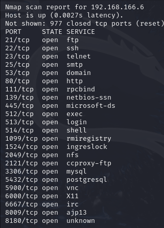
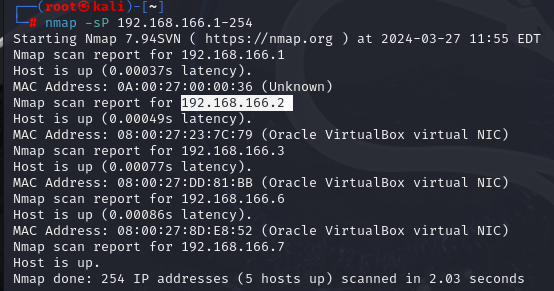

* # Nmap

* 網路發現：Nmap 可以幫助您發現網路上的主機和服務。
* port 掃描：Nmap 可以掃描主機的開放port。
* 作業系統檢測。
* 運行服務和版本檢測。
* 漏洞掃描：通過掃描服務和版本信息，Nmap 可以幫助發現目標上可能存在的安全漏洞。

| 指令                    | 描述                                      |
| -----------------------| ----------------------------------------- |
| `nmap <目標>`          | 執行基本的端口掃描，指定單個目標。        |
| `nmap -sV <目標>`      | 對目標進行服務版本檢測。                  |
| `nmap -O <目標>`       | 嘗試識別目標操作系統。                    |
| `nmap -A <目標>`       | 執行全面的掃描，包括版本檢測和操作系統識別。 |
| `nmap -p <port> <目標>`| 指定掃描的port範圍。                      |
| `nmap -T <速度> <目標>` | 設置掃描的速度。                          |
| `nmap -oN <文件名> <目標>`| 將掃描結果保存到指定文件中。              |
| `nmap -sS <目標>`      | 使用 TCP SYN 掃描技術進行掃描。           |
| `nmap -sU <目標>`      | 掃描目標的 UDP 端口。                     |
| `nmap -v <目標>`       | 顯示詳細輸出，提供更多信息。              |
| `nmap -h`              | 顯示幫助信息和可用選項。                  |

```
    nmap 192.168.166.6
```
得知目標有開哪些服務



```
    nmap -sP 192.168.166.1-254
```
得知目標範圍內有哪些IP正在啟動




https://ithelp.ithome.com.tw/articles/10299666

https://medium.com/%E7%92%BF%E7%9A%84%E7%AD%86%E8%A8%98%E6%9C%AC/nmap-%E5%85%A5%E9%96%80%E6%95%99%E5%AD%B8-36ed094d6ef8

其他工具：
https://ithelp.ithome.com.tw/articles/10251515

Wappalyzer
https://www.wappalyzer.com/

JSON injection 
https://www.invicti.com/learn/json-injection/

