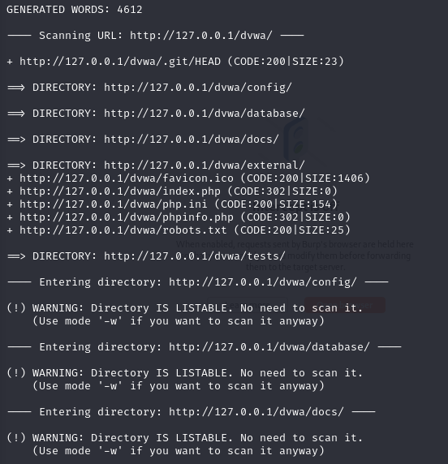
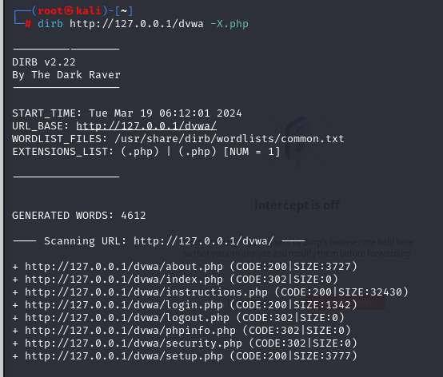

## Dirb 是什麼？

Dirb是一種用於在Web伺服器上進行目錄掃描的常用工具。它通常用於發現伺服器上隱藏的目錄或文件，以及嘗試找出潛在的敏感文件或目錄，例如未經授權的訪問或配置錯誤可能導致的漏洞。

Dirb（Directory Buster）的工作原理是嘗試使用給定的字典文件中的常見目錄和文件名，向目標伺服器發送HTTP請求，然後根據伺服器的回應來確定是否存在目標目錄或文件。如果伺服器返回一個有效的回應，那麼Dirb會將其列為發現的目錄或文件。
簡單說，就是對Web進行字典攻擊


## 使用方法

```
    dirb http://127.0.0.1/dvwa
```


* 指定特定查詢，使用-X表示，指定.php類別的資料
```
 dirb http://127.0.0.1/dvwa -X.php
```



## 其他常用命令

| 指令                     | 描述                                         |
| ------------------------ | -------------------------------------------- |
| `dirb <URL> <字典文件>` | 使用指定的字典文件進行目錄掃描。              |
| `dirb -o <輸出文件>`     | 將掃描解果輸出。                 |
| `dirb -r`                | 遞迴掃描，秀出目錄及子目錄。           |
| `dirb -S`                | 設置 HTTP 標頭文件。                           |
| `dirb -t <process 數>`       | 设置process，加快掃描速度。                   |
| `dirb -N`                | 不顯示沒有發現的頁面。                       |
| `dirb -p <代理>`         | 使用指定的代理。                             |

https://ithelp.ithome.com.tw/articles/10275958


預設字典擋位置：/usr/share/dirb/wordlists/以下

/usr/share/dirb/wordlists/vulns/apache.txt